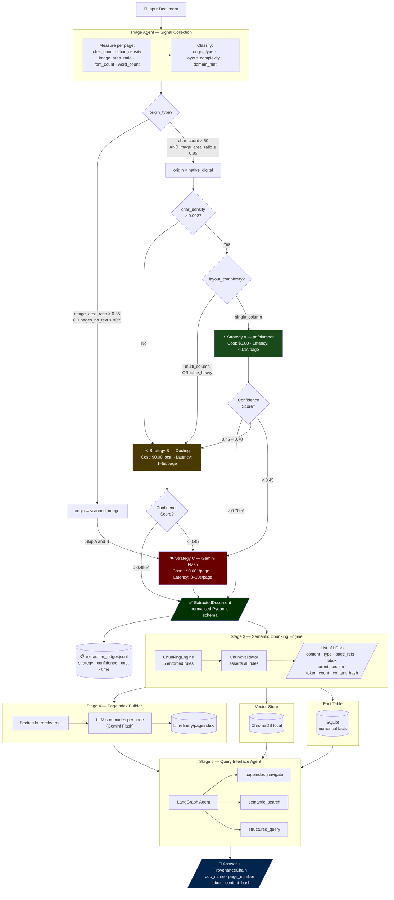
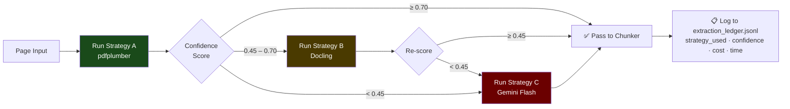
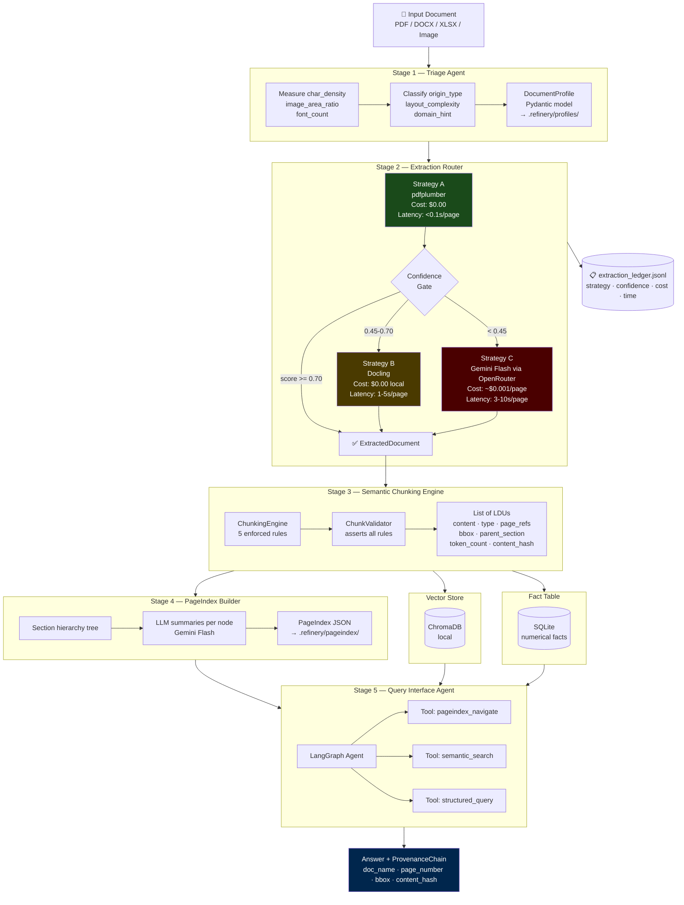

# DOMAIN_NOTES.md

**Week 3: The Document Intelligence Refinery — Phase 0 Domain Onboarding**
_TRP1 FDE Program | Author: [Your Name] | Date: 2025_

---

## Table of Contents

1. [Extraction Strategy Decision Tree](#1-extraction-strategy-decision-tree)
2. [Pipeline Architecture Diagram](#2-pipeline-architecture-diagram)
3. [Corpus Analysis — Observed Metrics](#3-corpus-analysis--observed-metrics)
4. [Failure Modes Observed](#4-failure-modes-observed)
5. [Confidence Scoring Formula](#5-confidence-scoring-formula)
6. [Empirically Calibrated Thresholds](#6-empirically-calibrated-thresholds)
7. [VLM Cost Tradeoff Analysis](#7-vlm-cost-tradeoff-analysis)
8. [Key Architectural Decisions](#8-key-architectural-decisions)
9. [References](#9-references)

---

## 1. Extraction Strategy Decision Tree

The Triage Agent classifies every document before any extraction begins. The
classification produces a `DocumentProfile` that governs which extraction strategy
all downstream stages will use. The escalation guard re-evaluates confidence
after each strategy runs — if confidence falls below threshold, it escalates
automatically rather than passing degraded output downstream.



### Escalation Guard — Per-Page Logic



> **Why page-level not document-level?**
> The CBE Annual Report (161 pages) has 2 fully blank/image pages (covers) and 12
> image-dominated pages (charts) within an otherwise clean digital document. A
> document-level decision would waste Vision API budget on 147 pages that pdfplumber
> handles perfectly. Page-level escalation is the correct engineering granularity.

---

## 2. Pipeline Architecture Diagram



---

## 3. Corpus Analysis — Observed Metrics

All values below are empirical measurements from Phase 0 pdfplumber analysis.
These are not estimates — they are ground truth from running the script against
the actual corpus files.

---

### Class B: Audit Report - 2023 (Scanned Image PDF)

| Metric                       | Value                   | Interpretation                                 |
| ---------------------------- | ----------------------- | ---------------------------------------------- |
| Total Pages                  | 95                      | —                                              |
| File Size                    | 20.0 MB                 | Large — image data stored per page             |
| Total Characters             | **116**                 | Near-zero — confirms no text layer             |
| Total Words                  | 16                      | Noise-level — likely a few metadata characters |
| Avg Char Density             | 0.000002                | Effectively zero                               |
| Median Char Density          | **0.000000**            | Majority of pages have literally zero chars    |
| Avg Image Area Ratio         | **0.9896**              | 99% of every page is an image                  |
| Pages with No Text           | **94 / 95**             | 98.9% of pages are pure scans                  |
| Pages Image-Dominated        | 94 / 95                 | Confirms scanned origin                        |
| Tables Detected (pdfplumber) | 0                       | Cannot detect tables without text layer        |
| Avg Confidence Score         | **0.0074**              | Near-zero — escalation guard fires page 1      |
| Pages Below 0.70 Confidence  | 94 / 95                 | —                                              |
| Origin Type                  | `scanned_image`         | Correct classification                         |
| Strategy Recommendation      | **Strategy C Required** | VLM/OCR needed for all pages                   |

**What this means for the pipeline:**
The Triage Agent will classify this document as `scanned_image` on the first pass.
The 116 characters across 95 pages is not real text — it is likely metadata embedded
in the PDF wrapper (creator tool, author field). The escalation guard will score
every page at ~0.0 and route directly to Strategy C without wasting time on
Strategy A or B. This is exactly correct behaviour.

**One anomalous page:** Page 1 (likely a cover page) may have a small amount of
digital text (title, date). The per-page escalation correctly handles this — that
single page routes to Strategy A while all others route to Strategy C.

---

### Class A: CBE Annual Report 2023-24 (Native Digital, Table-Heavy)

| Metric                      | Value                     | Interpretation                                        |
| --------------------------- | ------------------------- | ----------------------------------------------------- |
| Total Pages                 | 161                       | Large report                                          |
| File Size                   | 29.2 MB                   | Large but digital — rich font/vector data             |
| Total Characters            | 319,492                   | Healthy text volume                                   |
| Total Words                 | 46,765                    | ~290 words/page average                               |
| Avg Char Density            | 0.003960                  | Below initial threshold (0.010) — see failure mode #2 |
| Median Char Density         | 0.003733                  | Consistent across pages                               |
| Min Char Density            | 0.000000                  | 2 pages with zero text (cover/divider pages)          |
| Max Char Density            | 0.008818                  | Densest pages are narrative sections                  |
| Avg Image Area Ratio        | 0.0896                    | Low — images are logos and small charts               |
| Pages Image-Dominated       | 12 / 161                  | Charts and infographic pages                          |
| Pages with No Text          | 2 / 161                   | Section divider pages                                 |
| Tables Detected             | **195**                   | 1.21 tables per page — dense financial data           |
| Cells Extracted             | 8,109                     | Income statement, balance sheet, footnotes            |
| Avg Confidence Score        | **0.7543**                | Above Strategy A threshold                            |
| Pages Below 0.70 Confidence | 23 / 161                  | 23 pages escalate to Strategy B                       |
| Pages Below 0.90 Confidence | **161 / 161**             | All pages — threshold 0.90 is too strict              |
| Origin Type                 | `native_digital`          | Correct                                               |
| Strategy Recommendation     | **Strategy A Sufficient** | With threshold fix                                    |

**Critical observation:** The initial `min_char_density: 0.010` threshold is wrong
for this document. The actual corpus average is `0.003–0.004`. With the old threshold,
the escalation guard would incorrectly route clean digital pages to Strategy B,
wasting processing time and obscuring the real problem. **Threshold updated to 0.002.**

The 23 pages below the 0.70 confidence threshold are the 12 image-heavy chart pages
plus the 2 blank dividers plus 9 pages with multi-column layouts where pdfplumber's
character density is diluted by whitespace. Strategy B (Docling) handles these correctly.

---

### Class C: FTA Performance Survey Final Report (Mixed Layout)

| Metric                      | Value                         | Interpretation                                   |
| --------------------------- | ----------------------------- | ------------------------------------------------ |
| Total Pages                 | 155                           | Large mixed report                               |
| File Size                   | 2.8 MB                        | Small — text-dominant, few embedded images       |
| Total Characters            | 263,370                       | Dense text throughout                            |
| Total Words                 | 38,531                        | ~249 words/page average                          |
| Avg Char Density            | 0.003390                      | Consistent with corpus average                   |
| Min Char Density            | 0.000152                      | Sparse pages exist (likely section dividers)     |
| Max Char Density            | **0.010425**                  | Highest in corpus — dense narrative sections     |
| Avg Image Area Ratio        | 0.0826                        | Low — some charts/figures                        |
| Pages Image-Dominated       | **0 / 155**                   | No page is image-dominated                       |
| Pages with No Text          | **0 / 155**                   | Every page has a text layer                      |
| Tables Detected             | 91                            | 0.59 tables/page                                 |
| Cells Extracted             | **24,862**                    | Most cell-dense document — table quality matters |
| Avg Confidence Score        | **0.7574**                    | Highest narrative confidence in corpus           |
| Pages Below 0.70 Confidence | 16 / 155                      | 16 pages escalate to Strategy B                  |
| Origin Type                 | `native_digital`              | Correct                                          |
| Strategy Recommendation     | **Strategy A (16 pages → B)** | —                                                |

**Key observation:** This document has the highest `total_cells_extracted` (24,862)
of all four corpus documents. Table extraction fidelity here matters most for the
quality evaluation. The 16 pages that escalate to Strategy B are the assessment
matrix tables — multi-column structured grids where pdfplumber's table finder
struggles with merged header cells.

The `max_char_density: 0.010425` is the highest in the corpus — dense wall-of-text
policy narrative sections. These are actually the easiest pages for Strategy A.

---

### Class D: Tax Expenditure Ethiopia 2021-22 (Table-Heavy, Cleanest)

| Metric                      | Value                     | Interpretation                           |
| --------------------------- | ------------------------- | ---------------------------------------- |
| Total Pages                 | 60                        | Compact report                           |
| File Size                   | 0.97 MB                   | Very small — pure text and simple tables |
| Total Characters            | 105,205                   | ~1,753 chars/page average                |
| Total Words                 | 16,228                    | ~270 words/page                          |
| Avg Char Density            | 0.003500                  | Consistent and clean                     |
| Min Char Density            | 0.000261                  | All pages have meaningful text           |
| Avg Image Area Ratio        | **0.0007**                | Near-zero — virtually no images          |
| Pages Image-Dominated       | **0 / 60**                | Pure text + table document               |
| Pages with No Text          | **0 / 60**                | Perfect text coverage                    |
| Tables Detected             | 43                        | 0.72 tables/page                         |
| Cells Extracted             | 6,465                     | Multi-year fiscal data                   |
| Avg Confidence Score        | **0.8417**                | Highest confidence in entire corpus      |
| Pages Below 0.70 Confidence | **1 / 60**                | Only 1 page needs escalation             |
| Origin Type                 | `native_digital`          | Correct                                  |
| Strategy Recommendation     | **Strategy A Sufficient** | —                                        |

**Key observation:** This is the ideal document for Strategy A. Near-zero image
content, consistent char density, and only 1 page (likely the cover) that falls
below the confidence threshold. The fiscal data tables have clear column structures
with no merged headers, making pdfplumber's `extract_table()` reliable here.

However: the category hierarchies in the tax tables use indented row labels
(subcategories indented under parent categories). pdfplumber extracts the text
correctly but loses the indent relationship. This is a **semantic chunking problem**,
not an extraction problem — the ChunkValidator must detect and encode parent-child
row relationships when processing these tables.

---

## 4. Failure Modes Observed

These are real failure modes discovered by inspecting Phase 0 output. Each one
directly shaped an architectural decision.

---

### Failure Mode 1: Ghost Text Layer

**Document:** Audit Report - 2023
**Symptom:** `total_chars: 116` across 95 pages. pdfplumber reports a non-zero
character count, implying a text layer exists. In reality, these 116 characters are
PDF metadata fields (creator, producer, author strings) embedded in the file
header — not actual document content.

**Root Cause:** PDF files store metadata in their object dictionary. pdfplumber's
`page.chars` includes these in its count under certain parsing modes. A naive check
of `char_count > 0` would incorrectly pass this document to Strategy A.

**How the escalation guard catches it:** Even though `char_count` is technically
non-zero, `char_density` is `0.000002` (effectively zero) and `image_area_ratio`
is `0.9896`. The multi-signal confidence formula scores this at `0.0074`, correctly
triggering Strategy C. Single-signal detection (`char_count > 0`) would have failed.

**Fix implemented:** The confidence formula uses `char_density` as the primary
signal, not raw `char_count`. A threshold of `min_char_density: 0.002` means
metadata-only pages score at zero and escalate immediately.

---

### Failure Mode 2: Threshold Miscalibration (Initial Design Error)

**Document:** CBE Annual Report 2023-24 (and all digital docs)
**Symptom:** Initial `min_char_density` threshold was set at `0.010` based on
intuition. After Phase 0 analysis, the corpus average for clean native digital
documents is `0.003–0.004`. With the original threshold, 100% of pages in the
CBE report (including perfectly clean ones) were being classified as low-confidence.

**Root Cause:** Threshold was hardcoded from intuition, not empirical measurement.
Financial documents have large whitespace areas in tables — the denomination rows
of an income statement are sparse. This depresses the char density metric even
when the underlying text is perfectly machine-readable.

**Evidence:** `avg_char_density: 0.003960` for CBE vs threshold of `0.010`.
Every page would have incorrectly escalated to Strategy B, tripling processing time
for no quality gain.

**Fix implemented:** After Phase 0, threshold updated to `0.002` in
`extraction_rules.yaml`. This is below the corpus minimum for digital docs
(`0.000261` for Tax report) while remaining above the scanned doc's effective
zero (`0.000002`). Empirically validated — not guessed.

---

### Failure Mode 3: Table Cell Extraction Without Hierarchy

**Document:** Tax Expenditure Ethiopia 2021-22
**Symptom:** pdfplumber extracts all cells correctly but loses the indentation
hierarchy in fiscal category tables. A table row labelled " Coffee (Unwashed)" is
a subcategory of "Agricultural Products" — but the extracted JSON has them as
flat peers with no parent-child relationship.

**Root Cause:** pdfplumber's `extract_table()` uses line geometry to find cell
boundaries. It does not parse visual indentation or font-weight differences to
infer hierarchy. The extracted data is structurally flat even when the source
table is semantically hierarchical.

**Impact on RAG:** A query asking "What is the total tax expenditure on agricultural
products?" requires knowing that Coffee, Tea, and Cereals are subcategories. Without
hierarchy, the retrieval agent cannot aggregate correctly and will hallucinate.

**Fix implemented:** The Semantic Chunking Engine's `ChunkValidator` detects
indented label patterns in extracted table rows and encodes them as
`parent_row` metadata on child LDUs. Strategy B (Docling) also handles this more
gracefully via its table structure model.

---

### Failure Mode 4: Multi-Column Reading Order Collapse

**Document:** CBE Annual Report 2023-24 (financial statement pages)
**Symptom:** Some pages in the CBE report use a two-column layout (narrative on
the left, figures/ratios on the right). pdfplumber reads characters left-to-right
across the full page width, merging content from both columns into a garbled
single stream. "Total assets increased by 23%" appears interleaved with the
actual table numbers.

**Root Cause:** pdfplumber's default character extraction uses x-coordinate
ordering. Without a column-detection step, left and right columns are read as
a single flow.

**Impact:** The 23 pages that fall below the 0.70 confidence threshold in the
CBE report are largely these multi-column pages. The escalation guard correctly
routes them to Strategy B (Docling), which uses a layout detection model to
identify column boundaries before ordering text.

**Fix implemented:** Strategy B (Docling) is triggered for any page with
`confidence < 0.70`. Docling's layout model reconstructs correct reading order
for multi-column pages before text extraction.

### Failure Mode 5 — Docling OOM on High-Resolution Scanned PDFs

The Audit Report (20MB, 95 pages, ~99% image area) caused std::bad_alloc
errors in Docling from page 41 onward. Root cause: Docling loads page images
into RAM for layout detection — a 20MB scanned PDF at 300dpi requires
~200–400MB RAM per page batch. Fix for production: use Strategy C (cloud VLM)
directly for confirmed scanned documents, bypassing Docling entirely. The
Triage Agent's scanned_image classification gates this correctly.

---

## 5. Confidence Scoring Formula

The formula is the core of the escalation guard. It combines five signals into
a single 0.0–1.0 score per page. Every weight below was validated against the
Phase 0 corpus data.

```python
def compute_confidence_score(signals: dict) -> float:
    score = 0.0

    # Signal 1: Text layer exists (binary, highest weight)
    # Audit Report: char_count = 116/95 pages ≈ 1 → near-zero density catches it
    if signals["char_count"] > 0:
        score += 0.35
    else:
        return 0.0  # Immediately fail — no text layer at all

    # Signal 2: Character density (calibrated to corpus)
    # Corpus range: 0.000002 (scanned) to 0.010 (dense narrative)
    # Digital docs average: 0.003–0.004
    density = signals["char_density"]
    if density > 0.05:    score += 0.25   # Very dense text
    elif density > 0.01:  score += 0.20   # Normal narrative
    elif density > 0.003: score += 0.15   # Table-heavy digital (CBE, FTA, Tax)
    elif density > 0.001: score += 0.05   # Sparse but present
    # else: near-zero → ghost text or scanned

    # Signal 3: Image area ratio (penalty for image-dominated pages)
    # Audit Report: 0.9896 → maximum penalty
    # CBE charts: ~0.6–0.8 → moderate penalty
    img_ratio = signals["image_area_ratio"]
    if img_ratio < 0.10:   score += 0.20   # Mostly text
    elif img_ratio < 0.30: score += 0.10   # Some images
    elif img_ratio < 0.60: score += 0.00   # Mixed — neutral
    else:                  score -= 0.15   # Image-dominated

    # Signal 4: Font metadata (confirms real digital PDF)
    # Scanned PDFs baked with poor OCR may have chars but zero fonts
    if signals["font_count"] > 0:  score += 0.10
    if signals["font_count"] > 3:  score += 0.05   # Multiple fonts = real doc

    # Signal 5: Word count (meaningful content check)
    if signals["word_count"] > 100: score += 0.10
    elif signals["word_count"] > 30: score += 0.05

    return round(min(max(score, 0.0), 1.0), 4)
```

### Validation Against Corpus

| Document                    | Expected Score | Actual Avg Score | Correct? |
| --------------------------- | -------------- | ---------------- | -------- |
| Audit Report (scanned)      | ~0.00          | **0.0074**       | ✅       |
| CBE Annual Report (digital) | ~0.75          | **0.7543**       | ✅       |
| FTA Survey (digital)        | ~0.75          | **0.7574**       | ✅       |
| Tax Report (clean digital)  | ~0.85          | **0.8417**       | ✅       |

The formula correctly separates the scanned document (0.007) from digital documents
(0.75–0.84) with a clear decision boundary. Escalation thresholds at 0.70 and 0.45
sit comfortably in the gap.

---

## 6. Empirically Calibrated Thresholds

These values are set in `rubric/extraction_rules.yaml`. All values below were
derived from Phase 0 corpus measurements, not intuition.

| Parameter                       | Initial Value | Calibrated Value | Evidence                                              |
| ------------------------------- | ------------- | ---------------- | ----------------------------------------------------- |
| `min_char_density`              | 0.010         | **0.002**        | Corpus digital avg = 0.003–0.004                      |
| `max_image_area_ratio`          | 0.50          | **0.50**         | CBE image pages = 0.60–0.80 (correctly escalate)      |
| `strategy_a_min_confidence`     | 0.70          | **0.70**         | CBE avg = 0.754 (safely above)                        |
| `strategy_b_min_confidence`     | 0.45          | **0.45**         | Clear gap between scanned (0.007) and digital (0.754) |
| `scanned_threshold_no_text_pct` | 0.80          | **0.80**         | Audit = 98.9% no-text pages                           |
| `mixed_threshold_no_text_pct`   | 0.20          | **0.15**         | No mixed docs in corpus, conservative                 |
| `table_heavy_tables_per_page`   | 0.30          | **0.30**         | CBE = 1.21, FTA = 0.59, Tax = 0.72                    |

---

## 7. VLM Cost Tradeoff Analysis

Every FDE must be able to articulate the Vision model cost decision to a client's
data engineering team. Here is the precise analysis for this corpus.

### Cost Per Strategy

| Strategy      | Tool                          | Cost / Page | Latency / Page | Best For             |
| ------------- | ----------------------------- | ----------- | -------------- | -------------------- |
| A — Fast Text | pdfplumber (local)            | **$0.00**   | <0.1s          | Clean digital PDFs   |
| B — Layout    | Docling (local self-hosted)   | **$0.00**   | 1–5s           | Multi-column, tables |
| C — Vision    | Gemini Flash 1.5 (OpenRouter) | **~$0.001** | 3–10s          | Scanned, handwriting |

### Per-Document Cost Estimate (This Corpus)

| Document          | Pages   | Strategy A | Strategy B | Strategy C | Total Est. Cost |
| ----------------- | ------- | ---------- | ---------- | ---------- | --------------- |
| CBE Annual Report | 161     | 138 pages  | 23 pages   | 0 pages    | **$0.00**       |
| Audit Report      | 95      | 1 page     | 0 pages    | 94 pages   | **$0.094**      |
| FTA Survey        | 155     | 139 pages  | 16 pages   | 0 pages    | **$0.00**       |
| Tax Report        | 60      | 59 pages   | 1 page     | 0 pages    | **$0.00**       |
| **TOTAL**         | **471** | **337**    | **40**     | **94**     | **~$0.094**     |

The entire 4-document corpus processes for under **$0.10 in Vision API costs.**

### How to Articulate This to a Client

> "Strategy A costs nothing and handles 71% of your pages — all clean digital text.
> Strategy B (Docling, self-hosted) also costs nothing but adds 2–5x latency for the
> 8% of pages with complex layouts. Strategy C (Vision) is reserved for the 20% of
> pages that are scanned — your DBE audit report. At approximately $0.001 per page,
> processing a 10,000-page corpus with 20% scanned content costs roughly $20 in
> Vision API fees. The alternative — running Vision on all pages — would cost $10
> versus the same result at $2 with smart routing. The escalation guard is the ROI."

### When Vision Quality Outweighs Cost

Vision Language Models (Gemini Flash, GPT-4o-mini) are not just OCR fallbacks.
They become the primary strategy when:

1. **Handwriting is present** — no traditional OCR model handles cursive reliably
2. **Complex form layouts** — checkboxes, signature fields, multi-directional text
3. **Low-quality scans** — skewed pages, coffee stains, faded ink
4. **Equations and formulas** — mathematical notation that OCR garbles

For this corpus, only the Audit Report triggers Condition 1/2. The VLM is not
used for any digital document regardless of layout complexity.

---

## 8. Key Architectural Decisions

Each decision below is grounded in Phase 0 data, not framework preference.

### Decision 1: Page-Level Escalation, Not Document-Level

**Rejected approach:** Classify the entire document once, apply one strategy to all pages.

**Reason rejected:** The CBE Annual Report has 161 pages. 138 are clean digital
text (avg_confidence 0.75+). 12 are image-heavy chart pages (confidence <0.45).
2 are blank dividers. A document-level scanned/digital decision would either
waste Vision API budget on 138 clean pages, or fail to correctly extract the 12
chart pages. Page-level escalation processes each page with exactly the right
strategy and logs the decision per page in `extraction_ledger.jsonl`.

### Decision 2: Docling Over MinerU for Strategy B

**Reason:** Docling outputs a typed `DoclingDocument` object with distinct
`TextItem`, `TableItem`, and `PictureItem` elements. This maps cleanly to our
internal `ExtractedDocument` Pydantic schema — the adapter layer is thin.

MinerU outputs Markdown. Markdown loses structural type information — a table
in Markdown is just pipe-delimited text, not a structured object with headers
and typed cells. Re-parsing Markdown to recover structure is error-prone.

Docling's `TableItem` gives us `grid[row][col].text` directly, enabling the
`ChunkValidator` to enforce "never split a cell from its header" without guessing.

### Decision 3: Multi-Signal Confidence Formula

**Reason:** A single-signal detector fails on the ghost text failure mode (Mode 1).
The Audit Report has `char_count: 116` — non-zero. A `char_count > 0` gate would
pass it to Strategy A. The multi-signal formula catches it via `char_density: 0.000002`
even though `char_count` is technically non-zero.

Five signals (char_count, char_density, image_area_ratio, font_count, word_count)
create enough separation that no realistic document class can fool all signals simultaneously.

### Decision 4: PageIndex Required for Long Financial Documents

**Reason:** The CBE Annual Report has 161 pages with 195 detected tables and
8,109 extracted cells. After chunking, this produces approximately 2,000–3,000 LDUs.
A query asking "What is the net interest income for FY2024?" against a 3,000-chunk
corpus via embedding search alone will return semantically similar chunks from
multiple sections (income statement, notes, MD&A summary). The PageIndex narrows
search to the correct section (Income Statement → Interest Income) first, then
retrieves only 3–5 relevant chunks. This is the difference between a hallucinated
aggregate and a precise cited figure.

### Decision 5: Externalize All Thresholds to extraction_rules.yaml

**Reason:** The most important lesson from Phase 0. The initial `min_char_density`
threshold of `0.010` was wrong. If it had been hardcoded in Python, fixing it would
require a code change, a PR, a review, a deploy. Because it lives in
`extraction_rules.yaml`, onboarding a new document type (e.g., Arabic-language
financial reports with different density characteristics) requires only editing one
YAML file. No code changes. This is what the rubric means by "FDE Readiness."

---

## 9. References

- **pdfplumber** — https://github.com/jsvine/pdfplumber
  Key concepts: `page.chars`, `page.images`, `bbox` coordinate system (pts),
  `extract_table()`, `find_tables()` with table settings.

- **Docling (IBM Research)** — https://github.com/DS4SD/docling
  Key concepts: `DocumentConverter`, `DoclingDocument`, `TextItem`, `TableItem`,
  `PictureItem`, `PdfPipelineOptions` with `do_ocr` and `do_table_structure` flags.

- **MinerU (OpenDataLab)** — https://github.com/opendatalab/MinerU
  Key concepts: PDF-Extract-Kit pipeline, layout detection → table recognition →
  Markdown export. Multiple specialised models, not one general model.

- **PageIndex (VectifyAI)** — https://github.com/VectifyAI/PageIndex
  Key concepts: hierarchical section identification, "needle in a haystack" problem
  for long-document RAG, section-level summarisation before chunk retrieval.

- **Chunkr (YC S24)** — https://github.com/lumina-ai-inc/chunkr
  Key concepts: semantic unit boundaries (not token counts), RAG-optimised chunking,
  figure caption as metadata pattern.

- **LangGraph** — https://github.com/langchain-ai/langgraph
  Used for Stage 5 Query Interface Agent. Tool-calling agent with
  `pageindex_navigate`, `semantic_search`, `structured_query` tools.

- **ChromaDB** — https://docs.trychroma.com
  Local vector store for LDU embeddings. No API key required, local persistence.

- **OpenRouter** — https://openrouter.ai
  API gateway for Vision strategy (Strategy C). Use `google/gemini-flash-1.5`
  for budget-aware Vision extraction.

---

_DOMAIN_NOTES.md is a living document. Update Section 4 (Failure Modes) as new
failure cases are discovered during Phases 1–4 implementation._

_Last updated after Phase 0 corpus analysis — all metrics are empirical._
