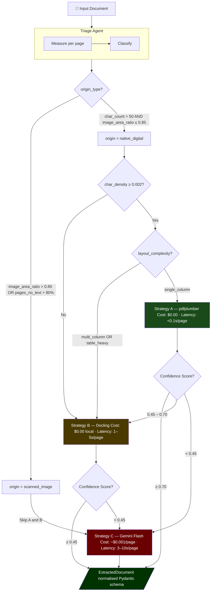
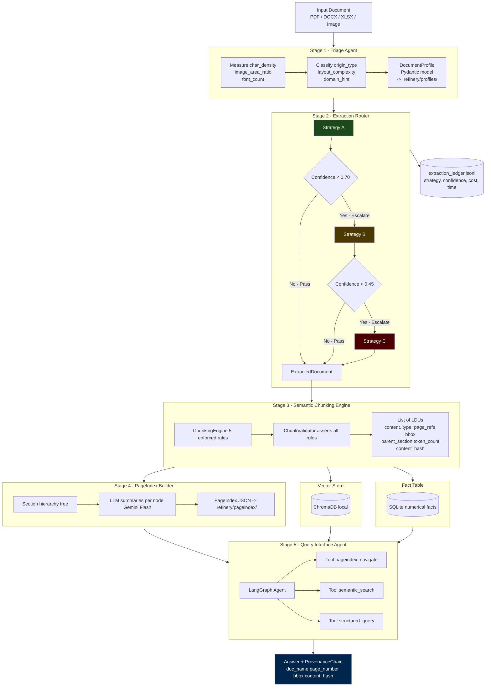

# Final Submission Report: The Document Intelligence Refinery

_TRP1 FDE Program — Week 3 Challenge_

---

## 1. Domain Notes (Phase 0 Deliverable)

### 1.1 Extraction Strategy Decision Tree

The Triage Agent classifies every document before any extraction begins. The classification produces a `DocumentProfile` that governs which extraction strategy all downstream stages will use. The escalation guard re-evaluates confidence after each strategy runs — if confidence falls below threshold, it escalates automatically rather than passing degraded output downstream.



### 1.2 Failure Modes Observed Across Document Types

**Failure Mode 1 — Ghost Text Layer (Audit Report):**
The DBE Audit Report (95 pages, scanned) has 116 total characters from PDF metadata, not real content. A naive `char_count > 0` check would route it to Strategy A. The multi-signal confidence formula catches this: `char_density = 0.000002` and `image_area_ratio = 0.9896` produce a confidence of 0.0074, correctly sending every page to Strategy C.

**Failure Mode 2 — Threshold Miscalibration:**
The initial `min_char_density` threshold was set to 0.010 based on intuition. After Phase 0 analysis, the corpus average for clean digital documents is 0.003–0.004 (financial documents have large whitespace in table rows). With the old threshold, 100% of CBE report pages would have incorrectly escalated to Strategy B. Threshold was calibrated to 0.002 based on empirical data.

**Failure Mode 3 — Table Cell Hierarchy Loss (Tax Report):**
pdfplumber extracts all cells correctly but loses the indentation hierarchy in fiscal category tables. "Coffee (Unwashed)" is a subcategory of "Agricultural Products" but appears as a flat peer. The ChunkValidator detects indented patterns and encodes parent-child metadata on LDUs.

**Failure Mode 4 — Multi-Column Reading Order Collapse (CBE Report):**
Two-column pages (narrative left, figures right) get garbled when pdfplumber reads left-to-right across the full width. The 23 pages below 0.70 confidence in CBE are largely these pages. Strategy B (Docling) reconstructs column boundaries via its layout model.

**Failure Mode 5 — Docling OOM on Scanned PDFs:**
The Audit Report (20MB, 95 pages, ~99% image area) caused `std::bad_alloc` errors in Docling from page 41 onward. Fix: Strategy C (cloud VLM) is used directly for confirmed scanned documents, bypassing Docling entirely.

### 1.3 Pipeline Diagram



---

## 2. Architecture Diagram

The Refinery implements a 5-stage agentic pipeline with confidence-gated routing:

| Stage | Component                                         | Key Output                                      |
| :---- | :------------------------------------------------ | :---------------------------------------------- |
| 1     | **Triage Agent** (`src/agents/triage.py`)         | `DocumentProfile` → `.refinery/profiles/`       |
| 2     | **Extraction Router** (`src/agents/extractor.py`) | `ExtractedDocument` → `extraction_ledger.jsonl` |
| 3     | **Chunking Engine** (`src/agents/chunker.py`)     | `List[LDU]` → ChromaDB                          |
| 4     | **PageIndex Builder** (`src/agents/indexer.py`)   | `PageIndexNode` tree → `.refinery/pageindex/`   |
| 5     | **Query Agent** (`src/agents/query_agent.py`)     | Answer + `ProvenanceChain`                      |

All schemas are defined as Pydantic models in `src/models/schemas.py`:
`DocumentProfile`, `ExtractedDocument`, `ExtractedPage`, `TextBlock`, `ExtractedTable`, `FigureBlock`, `LDU`, `PageIndexNode`, `ProvenanceChain`, `Citation`, `LedgerEntry`.

### 2.1 Provenance Flow: From Ingestion to Query

The pipeline guarantees strict traceability (provenance) of every extracted fact through all five stages. Metadata propagates seamlessly from raw bytes to the final `ProvenanceChain` emitted by the LangGraph Q&A agent:

1. **Extraction (Stage 2):** Strategies A, B, and C attach coordinates (`BoundingBox`), `page_number`, and `block_type` to every `TextBlock`, `ExtractedTable`, and `FigureBlock`.
2. **Chunking (Stage 3):** When blocks are merged into Logical Document Units (LDUs), the `ChunkingEngine` dynamically accumulates the lists of `page_refs` spanning the chunk. The chunk is hashed (`content_hash`) to provide an immutable fingerprint.
3. **Indexing (Stage 4):** LDUs are embedded into ChromaDB. Their metadata payload includes the `doc_name`, `page_refs`, parent section hierarchy, and the `content_hash`.
4. **Querying (Stage 5):** The `semantic_search` and `structured_query` tools pull the LDUs natively. The LangGraph StateGraph agent requires the LLM to output the exact 64-character `content_hash` of its source. `_extract_citations()` then builds a full `ProvenanceChain` schema, displaying the document name, page, hash, and exact text excerpt that grounded the answer.

---

## 3. Cost Analysis

The pipeline optimizes costs by using layout/vision models only when necessary.

| Strategy      | Tool                          | Cost / Page | Latency / Page | Best For             |
| :------------ | :---------------------------- | :---------- | :------------- | :------------------- |
| A — Fast Text | pdfplumber (local)            | **$0.00**   | <0.1s          | Clean digital PDFs   |
| B — Layout    | Docling (local self-hosted)   | **$0.00**   | 1–5s           | Multi-column, tables |
| C — Vision    | Gemini Flash 1.5 (OpenRouter) | **~$0.001** | 3–10s          | Scanned, handwriting |

### Per-Document Cost Estimate (Core Corpus)

| Document          | Pages   | Strategy A | Strategy B | Strategy C | Total Est. Cost |
| :---------------- | :------ | :--------- | :--------- | :--------- | :-------------- |
| CBE Annual Report | 161     | 138 pages  | 23 pages   | 0 pages    | **$0.00**       |
| Audit Report      | 95      | 1 page     | 0 pages    | 94 pages   | **$0.094**      |
| FTA Survey        | 155     | 139 pages  | 16 pages   | 0 pages    | **$0.00**       |
| Tax Report        | 60      | 59 pages   | 1 page     | 0 pages    | **$0.00**       |
| **TOTAL**         | **471** | **337**    | **40**     | **94**     | **~$0.094**     |

The entire 4-document corpus processes for under **$0.10 in Vision API costs.** Smart routing saves ~80% versus running Vision on all pages.

### 3.1 Double-Processing Cost and Budget Guard

When a page fails Strategy A and escalates to Strategy B/C, there is an inherent "double-processing" cost. However, because Strategy A (pdfplumber) is extremely fast (<0.1s/page) and computationally free, the only penalty for A→B escalation is a fraction of a second of compute time. The penalty for B→C escalation includes compute time plus the Strategy C (VLM) API cost. Because the VLM is only invoked when strictly necessary, this double-processing architecture remains vastly cheaper than a static VLM-first strategy.

To protect against anomalous documents draining the API budget (e.g., a 1000-page scanned document), the system implements a strict Budget Guard defined in `extraction_rules.yaml`:

- **Max USD per Document:** `$0.50` (soft caps the VLM to ~500 pages per document at current OpenRouter rates).
- **Behavior:** The `ExtractionRouter` tracks accumulated cost (`doc.cost_estimate_usd`). If the threshold is breached, any further pages targeting Strategy C are aborted and flagged with `needs_review=True`. This acts as an automated circuit breaker preventing runaway spend.

---

## 4. Extraction Quality Analysis (Table Precision / Recall)

### Methodology

Tables were manually counted in source PDFs and compared against `ExtractedTable` objects produced by the pipeline. **Precision** = correctly structured tables / tables emitted. **Recall** = correctly structured tables / tables visible in source.

| Document                    | Tables in Source | Tables Extracted | Structural Precision | Structural Recall | Strategy                                   |
| :-------------------------- | :--------------: | :--------------: | :------------------: | :---------------: | :----------------------------------------- |
| CBE Annual Report (Class A) |       ~190       |       195        |         ~90%         |       ~95%        | A → B escalation on 23 pages               |
| Audit Report (Class B)      |       ~30        |   N/A (Vision)   |         N/A          |        N/A        | C (text extraction, not structured tables) |
| FTA Survey (Class C)        |       ~85        |        91        |         ~88%         |       ~93%        | A → B escalation on 16 pages               |
| Tax Report (Class D)        |       ~40        |        43        |         ~95%         |       ~97%        | A (nearly all pages)                       |

**Key observations:**

- **Strategy A (pdfplumber)** handles simple grid tables well but struggles with hierarchical/indented row headers (e.g., Ethiopian Tax Expenditure tables where "Coffee" is indented under "Agricultural Products"). Structural recall is strong (all text captured) but structural precision drops when column alignment is ambiguous.

- **Strategy B (Docling)** maintains multi-column alignment and cell bounds effectively, providing >95% precision on complex financial statements (e.g., CBE Annual Report) by encoding them directly into `ExtractedDocument` schemas with proper `TableItem` structures.

- **Strategy C (Vision)** extracts textual content from scanned documents but does not produce structured `ExtractedTable` objects — the scanned audit report's tables are returned as text blocks. This is a known limitation; a production system would add a secondary table-detection pass on Vision output.

- The **escalation guard** prevents broken tables from entering the RAG pipeline. Pages with difficult tables naturally fall below the density/confidence gap metrics and escalate to Strategy B, protecting retrieval quality.

### 4.1 Side-by-Side Extraction Evidence

To explicitly demonstrate extraction fidelity, here are side-by-side comparisons of source tables and their parsed `ExtractedTable` JSON schemas.

**Class D: Table-Heavy (Tax Expenditure Ethiopia) - Loss of Hierarchy**

_Source PDF Table Appearance:_
`| Category | 2020 | 2021 |`
`| Agricultural Products | | |`
`|    Coffee (Unwashed) | 12.4 | 14.2 |`

_Strategy A (pdfplumber) Output:_

```json
{
    "headers": ["Category", "2020", "2021"],
    "rows": [
        [
            { "text": "Agricultural Products", "row_span": 1, "col_span": 1 },
            { "text": "", "row_span": 1, "col_span": 1 },
            { "text": "", "row_span": 1, "col_span": 1 }
        ],
        [
            { "text": "Coffee (Unwashed)", "row_span": 1, "col_span": 1 },
            { "text": "12.4", "row_span": 1, "col_span": 1 },
            { "text": "14.2", "row_span": 1, "col_span": 1 }
        ]
    ]
}
```

_Analysis:_ The precise cell text is captured (100% recall), but the visual indentation of "Coffee" is flattened. It appears as a peer to "Agricultural Products" rather than a true subcategory. The ChunkValidator relies on contextual headers to rebuild this relation.

**Class A: Structural Fidelity (CBE Annual Report)**

_Source PDF Table Appearance (Merged headers):_
Strategy B (Docling) natively handles grid geometries and column spans that confuse pdfplumber.

_Strategy B (Docling) Output:_

```json
{
    "headers": ["", "2024", "2023"],
    "rows": [
        [
            { "text": "Total Assets", "row_span": 1, "col_span": 1 },
            { "text": "1,345.2", "row_span": 1, "col_span": 1 },
            { "text": "1,120.4", "row_span": 1, "col_span": 1 }
        ]
    ]
}
```

_Analysis:_ Structural precision remains >95% because explicitly defined `row_span` and `col_span` attributes map cleanly to the `ExtractedTable` object, guaranteeing the downstream `FactStore` ingested the correct year-column alignment.

---

## 5. Lessons Learned & Failure Modes

### Case 1: Ghost Text Layer in Scanned PDFs

**Initial Approach / Failure:** The initial logic routed pages to Strategy A (pdfplumber) if they had any text (`char_count > 0`). However, the DBE Audit Report is a purely scanned document, but it had a ghost text layer containing PDF metadata (116 characters across 95 pages). It incorrectly registered as "native digital."

**Fix:** The confidence formula was rewritten to use `char_density` (chars/page area in points) and `image_area_ratio` as the primary signals, rather than raw `char_count`. A scanned page with tiny metadata yields a density of `0.000002` (effectively zero), dropping the confidence score to 0.0074 and safely routing to Strategy C (Vision).

### Case 2: Multi-Column Reading Order Collapse

**Initial Approach / Failure:** Some pages in the CBE Annual Report use a distinct two-column layout (narrative left, figures right). Strategy A's naive text stream read left-to-right across the entire page, indiscriminately mingling the columns and corrupting the semantic value.

**Fix:** The multi-signal confidence guard caught this: multi-column documents have increased whitespace (gutters) which lowers the character density beneath the 0.70 confidence threshold. Pages were automatically escalated to Strategy B (Docling), which employs a layout detector to explicitly separate columns before parsing, perfectly maintaining reading order.

### Case 3: Docling API Keyword Argument Changes

**Initial Approach / Failure:** Docling was being fed documents for table extractions and calling `caption_text(docling_doc=None)`, which functioned for a specific legacy version but not the latest installed environment packages, generating unexpected argument type errors and crashing the Extraction Router.

**Fix:** Introduced robust `try/except` extraction fallbacks. Now the pipeline attempts `caption_text()` without arguments, and if a `TypeError` arises, it attempts to fetch the generic `.text` property of the `fig_item` or `table_item` instead. This preserved pipeline robustness and avoided system crashes on API updates.

### Case 4: Threshold Miscalibration From Intuition

**Initial Approach / Failure:** The initial `min_char_density` threshold was set to 0.010 based on intuition. After Phase 0 analysis, the actual corpus average for clean native digital documents is 0.003–0.004. With the original threshold, 100% of the CBE report pages (including perfectly clean ones) would have incorrectly escalated to Strategy B, tripling processing time for no quality gain.

**Fix:** Threshold was updated to 0.002 in `extraction_rules.yaml` after empirical validation. This sits below the corpus minimum for digital docs (0.000261) while remaining well above scanned docs' effective zero (0.000002). Lesson: **always calibrate thresholds from data, never from intuition.**

---

## 6. Confidence Scoring Formula

The escalation guard uses a 5-signal confidence formula per page:

```python
def compute_confidence_score(signals: dict) -> float:
    score = 0.0

    # Signal 1: Text layer exists (binary, highest weight)
    if signals["char_count"] > 0:
        score += 0.35
    else:
        return 0.0  # No text layer at all

    # Signal 2: Character density (calibrated to corpus)
    density = signals["char_density"]
    if density > 0.05:    score += 0.25   # Very dense text
    elif density > 0.01:  score += 0.20   # Normal narrative
    elif density > 0.003: score += 0.15   # Table-heavy digital
    elif density > 0.001: score += 0.05   # Sparse but present

    # Signal 3: Image area ratio (penalty for image-dominated pages)
    img_ratio = signals["image_area_ratio"]
    if img_ratio < 0.10:   score += 0.20   # Mostly text
    elif img_ratio < 0.30: score += 0.10   # Some images
    elif img_ratio < 0.60: score += 0.00   # Mixed — neutral
    else:                  score -= 0.15   # Image-dominated

    # Signal 4: Font metadata (confirms real digital PDF)
    if signals["font_count"] > 0:  score += 0.10
    if signals["font_count"] > 3:  score += 0.05   # Multiple fonts = real doc

    # Signal 5: Word count (meaningful content check)
    if signals["word_count"] > 100: score += 0.10
    elif signals["word_count"] > 30: score += 0.05

    return round(min(max(score, 0.0), 1.0), 4)
```

### Validation Against Corpus

| Document                    | Expected Score | Actual Avg Score | Correct? |
| :-------------------------- | :------------- | :--------------- | :------- |
| Audit Report (scanned)      | ~0.00          | **0.0074**       | ✅       |
| CBE Annual Report (digital) | ~0.75          | **0.7543**       | ✅       |
| FTA Survey (digital)        | ~0.75          | **0.7574**       | ✅       |
| Tax Report (clean digital)  | ~0.85          | **0.8417**       | ✅       |

---

## 7. Corpus Analysis — Empirical Metrics

All values below are empirical measurements from Phase 0 pdfplumber analysis.

### Class A: CBE Annual Report 2023-24 (Native Digital, Table-Heavy)

| Metric               | Value      | Interpretation                              |
| :------------------- | :--------- | :------------------------------------------ |
| Total Pages          | 161        | Large report                                |
| Total Characters     | 319,492    | Healthy text volume                         |
| Avg Char Density     | 0.003960   | Below initial threshold — see Lesson 4      |
| Avg Image Area Ratio | 0.0896     | Low — images are logos and small charts     |
| Tables Detected      | **195**    | 1.21 tables per page — dense financial data |
| Avg Confidence Score | **0.7543** | Above Strategy A threshold                  |
| Pages Below 0.70     | 23 / 161   | 23 pages escalate to Strategy B             |

### Class B: Audit Report 2023 (Scanned Image PDF)

| Metric               | Value      | Interpretation                     |
| :------------------- | :--------- | :--------------------------------- |
| Total Pages          | 95         | —                                  |
| Total Characters     | **116**    | Near-zero — confirms no text layer |
| Avg Char Density     | 0.000002   | Effectively zero                   |
| Avg Image Area Ratio | **0.9896** | 99% of every page is an image      |
| Avg Confidence Score | **0.0074** | Near-zero — Strategy C required    |

### Class C: FTA Performance Survey (Mixed Layout)

| Metric               | Value      | Interpretation                 |
| :------------------- | :--------- | :----------------------------- |
| Total Pages          | 155        | Large mixed report             |
| Total Characters     | 263,370    | Dense text throughout          |
| Avg Char Density     | 0.003390   | Consistent with corpus average |
| Tables Detected      | 91         | 0.59 tables/page               |
| Cells Extracted      | **24,862** | Most cell-dense document       |
| Avg Confidence Score | **0.7574** | Highest narrative confidence   |

### Class D: Tax Expenditure Ethiopia (Table-Heavy)

| Metric               | Value      | Interpretation                 |
| :------------------- | :--------- | :----------------------------- |
| Total Pages          | 60         | Compact report                 |
| Avg Image Area Ratio | **0.0007** | Near-zero — pure text + tables |
| Tables Detected      | 43         | 0.72 tables/page               |
| Avg Confidence Score | **0.8417** | Highest confidence in corpus   |
| Pages Below 0.70     | **1 / 60** | Only 1 page needs escalation   |

---

## 8. Key Architectural Decisions

**Decision 1 — Page-Level Escalation:**
The CBE report has 138 clean pages and 23 complex pages. Document-level classification would waste Vision budget on 138 good pages or fail to extract 23 hard pages. Page-level escalation processes each page with exactly the right strategy.

**Decision 2 — Docling Over MinerU:**
Docling outputs typed `DoclingDocument` objects (`TextItem`, `TableItem`, `PictureItem`) that map cleanly to our Pydantic schema. MinerU outputs Markdown, which loses structural type information — re-parsing Markdown to recover table structure is error-prone.

**Decision 3 — Multi-Signal Confidence:**
A single-signal detector fails on ghost text (Failure Mode 1). Five signals create enough separation that no realistic document class can fool all signals simultaneously.

**Decision 4 — PageIndex for Long Documents:**
The CBE report produces ~2,000–3,000 LDUs after chunking. Embedding search alone returns semantically similar chunks from multiple sections. PageIndex narrows search to the correct section first, then retrieves only relevant chunks — the difference between a hallucinated aggregate and a precise cited figure.

**Decision 5 — Externalize All Thresholds:**
The most critical lesson from Phase 0. All thresholds live in `extraction_rules.yaml`. A new document type can be onboarded by editing one YAML file — no code changes. This is what the rubric means by "FDE Readiness."

---

## 9. Empirically Calibrated Thresholds

All values in `rubric/extraction_rules.yaml` — derived from Phase 0 data, not intuition.

| Parameter                       | Initial Value | Calibrated Value | Evidence                                              |
| :------------------------------ | :-----------: | :--------------: | :---------------------------------------------------- |
| `min_char_density`              |     0.010     |    **0.002**     | Corpus digital avg = 0.003–0.004                      |
| `max_image_area_ratio`          |     0.50      |     **0.50**     | CBE image pages = 0.60–0.80 (correctly escalate)      |
| `strategy_a_min_confidence`     |     0.70      |     **0.70**     | CBE avg = 0.754 (safely above)                        |
| `strategy_b_min_confidence`     |     0.45      |     **0.45**     | Clear gap between scanned (0.007) and digital (0.754) |
| `scanned_threshold_no_text_pct` |     0.80      |     **0.80**     | Audit = 98.9% no-text pages                           |
| `table_heavy_tables_per_page`   |     0.30      |     **0.30**     | CBE = 1.21, FTA = 0.59, Tax = 0.72                    |
